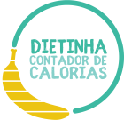

**:warning: Work in Progress!**

 

<h1 align='center'>DIETINHA: Front end</h1>

    
     
     
    <a href="https://dietinha.cf" ><strong>Deploy</strong></a>
     
    <a href="https://github.com/augustolfp/calories-tracker-backend"><strong>Repositório do Back end</strong></a>

 

# Descrição

Um aplicativo para registrar e contabilizar o consumo diário de macronutrientes, que utiliza dados nutricionais da tabela TACO - UNICAMP.

 

# Motivação

Decidi, faz algum tempo, adotar um estilo de vida mais saudável e recompensador. Ao começar a praticar esportes com frequência e cuidar da minha alimentação, surgiu a necessidade de prestar mais atenção na minha ingestão diária de calorias.

Procurei, então, aplicativos que pudessem me ajudar nessa função, e de certa forma me decepcionei com as alternativas disponíveis:

-   Todos os aplicativos eram complexos demais, com muitas funções agregadas que atrapalhavam o uso no dia-a-dia;
-   A maioria que testei utilizavam dados de alimentos estrangeiros (alimentos podem apresentar informações nutricionais diferentes dependendo da região);
-   Boa parte deles não são 100% gratuitos, e requerem pagamaneto para utilizar algumas funções que considero essenciais.

Nessa situação, decidi construir meu próprio contador de calorias!

 

# Objetivos

Esse projeto nasceu para cumprir uma série de objetivos:

-   Precisa ser fácil de ser utilizado. Quanto mais simples, melhor;
-   Precisa fornecer dados de alimentos do Brasil;
-   Deve oferecer a opção de registrar alimentos personalizados;
-   Deve ser grátis e _Open-source_.

 

# Interface

 

# Como utilizar

 

# Ferramentas utilizadas

  

 

 

 

# Testes

 

# Próximos passos
